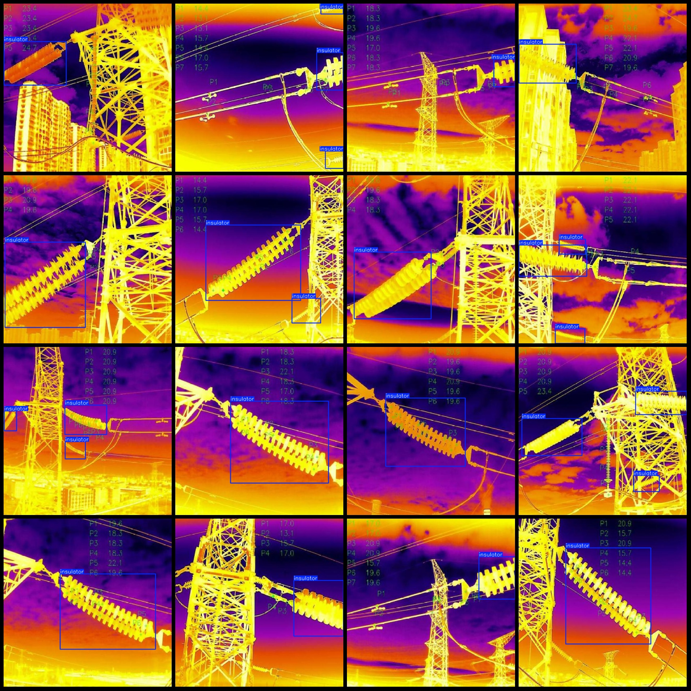
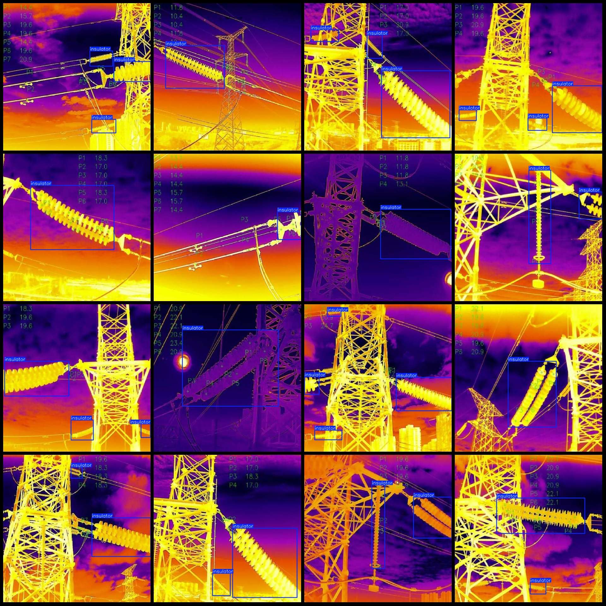

# Power Scene Infrared Image Omnisiron Detection Dataset VOC+YOLO format, 420 categories

Dataset format: Pascal VOC format+YOLO format (without split path in txt file, only contain jpg images and corresponding VOC formatxml file and yolo formattxt file)
number of images: 420  
annotation count: 420  
annotation count: 420  
annotationnumber of classes: 1  
annotation class names:["insulator"]  
boxes per class:   
insulator box count = 813  
total boxes: 813  
image resolution: 640x640  
Use annotation tool: labelImg
Annotation rules: draw a rectangle around the class.
Important notes: The dataset needs to be divided into training, validation, and test sets.
Special statement: This dataset does not guarantee the accuracy of the trained model or weight files.
Image preview:
## Images

Here is a pay link on Stripe ( https://buy.stripe.com/3cs8yP7sY87d0vu9AB ). Please contact me lonlonago@foxmail.com after funding $89, and I will send you a complete data files , thank you!

